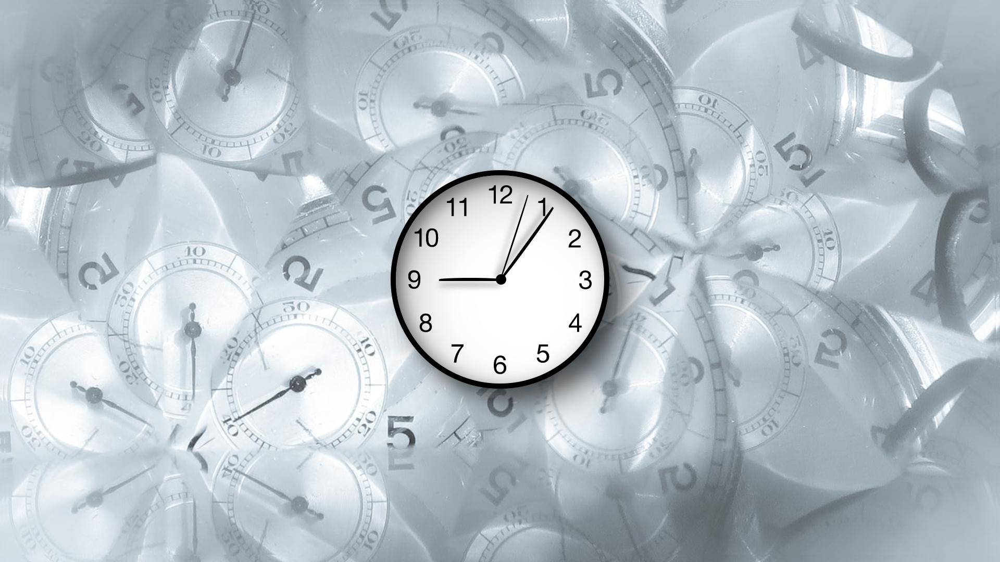

# Analog Clock
> Simple Analog Clock created with HTML, CSS and JavaScript

## Table of contents
* [General info](#general-info)
* [Screenshots](#screenshots)
* [Technologies](#technologies)
* [Status](#status)
* [Contact](#contact)

## General info
A clock that shows what time it is in real time

## Screenshots

## Technologies
* HTML5
* CSS3
* JavaScript/ES6

## Status
Project is:_finished_

## Contact
Created by [@Dan](https://www.linkedin.com/in/danail-kostov-ba95b81b3/) - feel free to contact me!